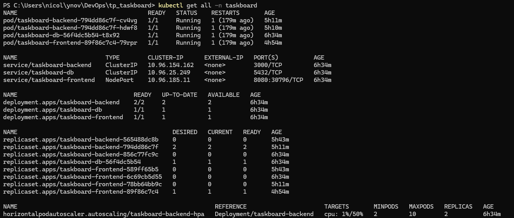
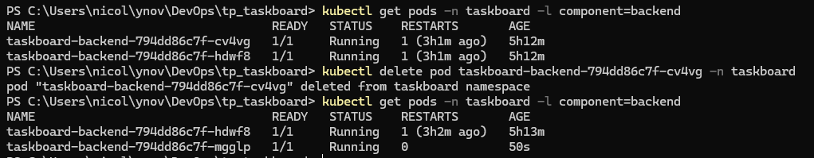
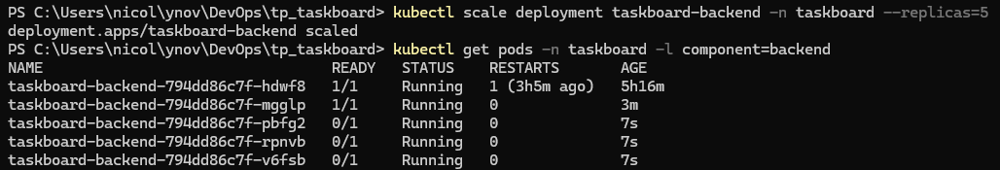
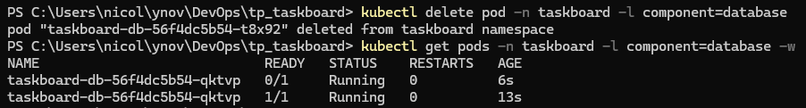
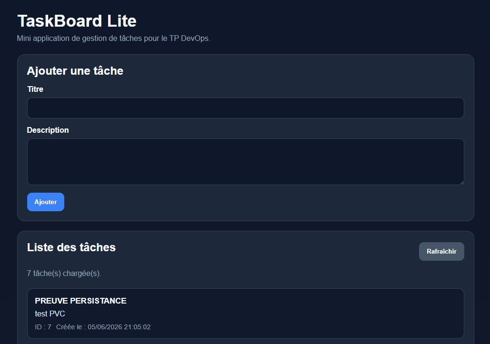
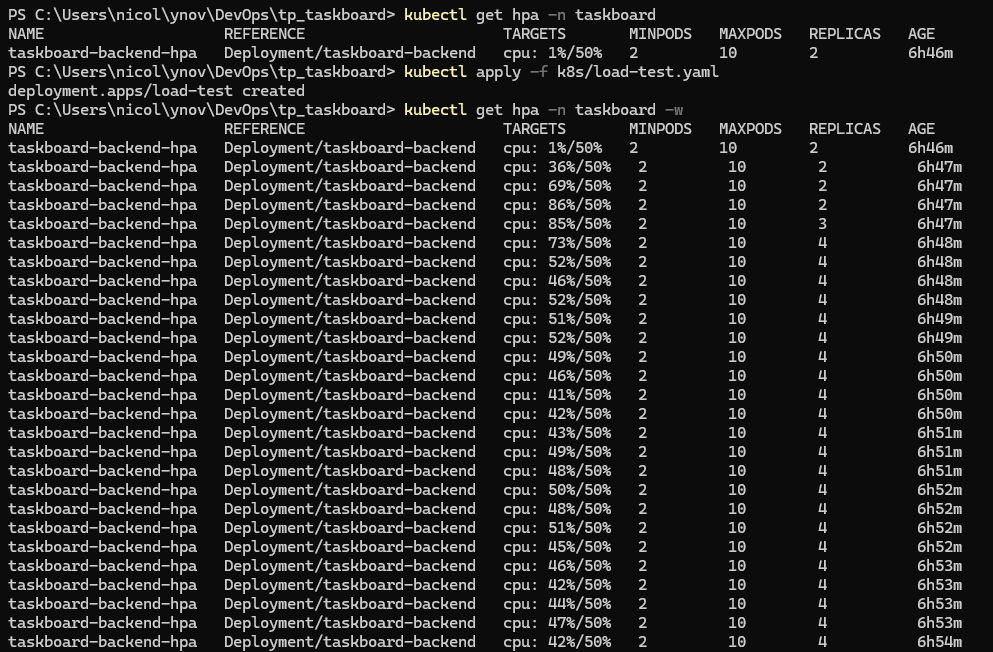

# Rapport TP Kubernetes — TaskBoard

> **Brouillon Markdown.** Pour le rendu final (PDF, 2 pages max), conserver en priorité :
> le schéma d'architecture, le tableau des objets, les choix techniques et 2 captures
> (`kubectl get all` + une démo). Le détail des commandes peut être résumé.

| Membre | Prénom | Rôle |
|--------|--------|------|
| A | Josué | Infrastructure & Configuration |
| B | Alexis | Backend & Robustesse |
| C | Nicolas | Frontend, Exposition & Rapport |

**Cluster :** Docker Desktop (Kubernetes activé) — **Namespace :** `taskboard`

---

## 1. Introduction

L'objectif du TP est de redéployer **TaskBoard** — une application 3-tiers (frontend
statique HTML/CSS/JS, backend Node.js/Express, base PostgreSQL) conteneurisée en
séance 1 avec Docker Compose — sur un cluster **Kubernetes** (Docker Desktop).

Au-delà du simple déploiement, le TP met l'accent sur les bonnes pratiques
d'exploitation : **configuration externalisée** (ConfigMap / Secret), **persistance
des données** (PersistentVolumeClaim), **haute disponibilité** (replicas +
readinessProbe), **exposition** propre (Ingress) et **mise à l'échelle automatique**
(HorizontalPodAutoscaler).

---

## 2. Architecture Kubernetes

```
                    Navigateur (http://taskboard.local)
                                  │
                                  ▼
                ┌─────────────────────────────────────┐
                │   Ingress nginx  (taskboard-ingress) │
                │   /      → frontend                  │
                │   /api/* → backend  (rewrite /api→/) │
                └───────────────┬──────────────┬───────┘
                                │              │
              / (UI statique)   │              │  /api/* (REST)
                                ▼              ▼
                   ┌────────────────┐   ┌────────────────────┐
                   │ Svc frontend   │   │ Svc backend        │
                   │ (NodePort 8080)│   │ (ClusterIP 3000)   │
                   └───────┬────────┘   └─────────┬──────────┘
                           ▼                      ▼
                   ┌────────────────┐   ┌────────────────────┐
                   │ Pod frontend×1 │   │ Pods backend ×2     │◄── HPA (2→10, CPU 50%)
                   │ (serve, :8080) │   │ (Express, :3000)    │
                   └────────────────┘   └─────────┬──────────┘
                                                   ▼
                                        ┌────────────────────┐
                                        │ Svc db (ClusterIP)  │
                                        │ :5432               │
                                        └─────────┬──────────┘
                                                  ▼
                                        ┌────────────────────┐
                                        │ Pod PostgreSQL ×1   │
                                        │  + PVC 1Gi (durable)│
                                        └────────────────────┘

   La DB n'est JAMAIS exposée hors du cluster (ClusterIP).
   Flux : navigateur → Ingress → frontend / backend → backend → DB.
```

### Objets déployés (namespace `taskboard`)

| Objet | Nom | Rôle |
|---|---|---|
| Namespace | `taskboard` | Isolation de tous les objets du projet |
| ConfigMap | `taskboard-config` | Config non sensible (DB_HOST, ports, noms) |
| Secret | `taskboard-secret` | `DB_PASSWORD` (base64, jamais en clair) |
| ConfigMap | `taskboard-db-init` | Script `init.sql` (montée au 1er démarrage) |
| PVC | `taskboard-db-pvc` | Stockage durable PostgreSQL (1 Gi, RWO) |
| Deployment | `taskboard-db` | PostgreSQL 16-alpine, 1 replica (stratégie `Recreate`) |
| Deployment | `taskboard-backend` | API Node.js, **2 replicas** |
| Deployment | `taskboard-frontend` | UI statique, 1 replica |
| Service | `taskboard-db` | ClusterIP 5432 (interne) |
| Service | `taskboard-backend` | ClusterIP 3000 (interne) |
| Service | `taskboard-frontend` | NodePort 8080 (accès direct) |
| Ingress | `taskboard-ingress` | Routage `/` → front, `/api` → back |
| HPA | `taskboard-backend-hpa` | Autoscaling backend (2→10, CPU 50%) |

---

## 3. Choix techniques justifiés

- **ConfigMap + Secret (config externalisée).** Toute la configuration vit hors des
  images : `taskboard-config` (hôte/ports/noms de base) est injecté via `envFrom`,
  et le mot de passe est isolé dans `taskboard-secret` (base64), lu via `secretKeyRef`.
  → On change la config sans rebuild, et le secret n'apparaît jamais en clair dans un
  Deployment.

- **PVC pour PostgreSQL (persistance).** Les données sont montées sur
  `/var/lib/postgresql/data` depuis un PVC de 1 Gi (`ReadWriteOnce`). La durée de vie
  du volume est découplée de celle du pod : si le pod DB est supprimé/recréé, **les
  données survivent**. Le Deployment DB utilise la stratégie `Recreate` (et non
  `RollingUpdate`) car PostgreSQL ne tolère pas deux writers sur le même volume.

- **Backend en 2 replicas + probes.** Deux replicas assurent la **haute disponibilité**
  (un pod peut tomber sans coupure) et fournissent un plancher au HPA. Probes :
  - `startupProbe` /health (30×5 s) : absorbe le démarrage lent de PostgreSQL ;
  - `readinessProbe` /health : sort le pod du Service si la DB est injoignable ;
  - `livenessProbe` TCP:3000 : prouve que le process Express est vivant **sans**
    dépendre de la DB (redémarrer le backend ne répare jamais la base → évite les
    CrashLoopBackOff en cascade).

- **DB en ClusterIP uniquement.** La base n'est accessible que depuis l'intérieur du
  cluster ; aucune exposition externe (exigence de sécurité du TP).

- **`imagePullPolicy: IfNotPresent`.** Spécificité Docker Desktop : utiliser les images
  buildées localement plutôt que de tenter un pull distant.

- **URL de l'API côté frontend = `/api` (relatif).** Le frontend est **statique** : une
  variable d'env de conteneur n'atteint pas le JavaScript du navigateur. On exploite
  donc le fait que l'Ingress sert frontend et backend sur la **même origine**
  (`taskboard.local`) : `app.js` appelle `/api/...`, que l'Ingress route vers le backend
  (rewrite `/api` → `/`). *Alternative envisagée : injecter `window.API_BASE_URL` via une
  ConfigMap montée en `config.js` — utile pour des URL absolues multi-environnements,
  superflu ici grâce au same-origin.*

---

## 4. Déploiement pas à pas (5 phases)

### Phase 0 — Prérequis
Activer Kubernetes dans Docker Desktop, puis builder les images **localement** :
```powershell
docker build -t taskboard-backend:latest ./taskboard/backend
docker build -t taskboard-frontend:latest ./taskboard/frontend
```

### Phase 1 — Stack de base (Membre A)
```powershell
kubectl apply -f k8s/namespace.yaml
kubectl apply -f k8s/config.yaml      # ConfigMap + Secret
kubectl apply -f k8s/database.yaml    # PVC + Deployment + Service DB
kubectl apply -f k8s/backend.yaml     # Deployment 2 replicas + Service
kubectl apply -f k8s/frontend.yaml    # Deployment + Service NodePort
kubectl get all -n taskboard
```

### Phase 2 — Robustesse (Membre B)
Probes (`startup` / `readiness` / `liveness`) et `resources.requests/limits` définis sur
le backend ; validation du self-healing, du scaling et de la persistance (§5).

### Phase 3 — Exposition / Ingress (Membre C)
```powershell
kubectl apply -f https://raw.githubusercontent.com/kubernetes/ingress-nginx/controller-v1.10.1/deploy/static/provider/cloud/deploy.yaml
kubectl wait --namespace ingress-nginx --for=condition=ready pod --selector=app.kubernetes.io/component=controller --timeout=120s
kubectl apply -f k8s/ingress.yaml
```
Ajouter `127.0.0.1  taskboard.local` dans `C:\Windows\System32\drivers\etc\hosts`, puis
`ipconfig /flushdns`. Détail complet : [ingress-setup.md](ingress-setup.md).

### Phase 4 — Autoscaling / HPA (Membre C)
```powershell
kubectl apply -f https://github.com/kubernetes-sigs/metrics-server/releases/latest/download/components.yaml
# Docker Desktop : autoriser le metrics-server à interroger le kubelet en TLS auto-signé
kubectl patch deployment metrics-server -n kube-system --type='json' `
  -p='[{"op":"add","path":"/spec/template/spec/containers/0/args/-","value":"--kubelet-insecure-tls"}]'
kubectl apply -f k8s/hpa.yaml
```

> **Charger les images dans le node Kubernetes (Docker Desktop).** Le node K8s a un
> containerd **isolé** du cache Docker de l'hôte : sans cette étape, les pods restent en
> `ImagePullBackOff` (→ 503). Pour chaque image :
> ```powershell
> docker save taskboard-frontend:latest -o frontend.tar
> docker cp frontend.tar desktop-control-plane:/frontend.tar
> docker exec desktop-control-plane ctr --namespace k8s.io images import /frontend.tar
> kubectl rollout restart deployment/taskboard-frontend -n taskboard
> ```

### Preuve : `kubectl get all -n taskboard`

```
NAME                                      READY   STATUS    RESTARTS   AGE
pod/taskboard-backend-856c77fc9c-8vkcj    1/1     Running   0          119s
pod/taskboard-backend-856c77fc9c-rltbk    1/1     Running   0          119s
pod/taskboard-db-56f4dc5b54-krqfc         1/1     Running   0          119s
pod/taskboard-frontend-6c69cb5d55-cxw4k   1/1     Running   0          118s

service/taskboard-backend    ClusterIP   10.96.205.245   <none>   3000/TCP
service/taskboard-db         ClusterIP   10.96.172.213   <none>   5432/TCP
service/taskboard-frontend   NodePort    10.96.41.252    <none>   8080:32358/TCP

deployment.apps/taskboard-backend    2/2   2   2   119s
deployment.apps/taskboard-db         1/1   1   1   119s
deployment.apps/taskboard-frontend   1/1   1   1   118s
```

---

## 5. Démonstrations réalisées

### 5.1 Self-healing
```powershell
kubectl get pods -n taskboard -l component=backend
kubectl delete pod <nom-d-un-pod-backend> -n taskboard
kubectl get pods -n taskboard -w     # un nouveau pod est recréé automatiquement
```
Le ReplicaSet maintient l'état désiré (2 replicas) : un pod supprimé est immédiatement
recréé.



### 5.2 Scaling manuel
```powershell
kubectl scale deployment taskboard-backend -n taskboard --replicas=5
kubectl get pods -n taskboard -l component=backend -o wide   # 5 pods
kubectl scale deployment taskboard-backend -n taskboard --replicas=2   # retour
```
Le Service `taskboard-backend` répartit le trafic sur l'ensemble des pods prêts.



### 5.3 Persistance des données
```powershell
# 1) Créer des tâches via l'UI (http://taskboard.local) ou en direct :
curl -X POST http://taskboard.local/api/tasks -H "Content-Type: application/json" -d '{\"title\":\"Test persistance\"}'
# 2) Supprimer le pod PostgreSQL :
kubectl delete pod -n taskboard -l component=database
kubectl get pods -n taskboard -w     # attendre le nouveau pod Running
# 3) Vérifier que les données sont toujours là :
curl http://taskboard.local/api/tasks
```
Les tâches survivent à la suppression du pod grâce au **PVC** (le volume est réattaché
au nouveau pod).





### 5.4 Autoscaling (HPA)
```powershell
kubectl apply -f k8s/load-test.yaml          # génère de la charge sur /tasks
kubectl get hpa -n taskboard -w              # CPU grimpe > 50% → replicas augmentent
kubectl get pods -n taskboard -l component=backend -w
kubectl delete -f k8s/load-test.yaml         # scale-down après la fenêtre de 5 min
```
Le HPA passe de 2 vers jusqu'à 10 replicas quand le CPU dépasse 50 % des `requests`,
puis réduit prudemment une fois la charge retombée.



---

## 6. Difficultés rencontrées

| Symptôme | Cause | Solution |
|---|---|---|
| `503` / `ImagePullBackOff` | Images locales invisibles du node K8s (containerd isolé sous Docker Desktop) | `docker save` + `docker cp` vers `desktop-control-plane` + `ctr images import` |
| `ERR_CONNECTION_REFUSED` sur `localhost:3000` | Le frontend ciblait `localhost` au lieu du backend cluster | URL relative `/api` + routage par l'Ingress (same-origin) |
| HPA en `<unknown>` pour le CPU | metrics-server refuse le certificat kubelet de Docker Desktop | Ajout de l'argument `--kubelet-insecure-tls` au metrics-server |
| Backend redémarré pendant le démarrage de la DB | `livenessProbe` dépendante de la DB pendant le boot lent de PostgreSQL | `startupProbe` /health + `livenessProbe` **TCP** (indépendante de la DB) |

---

## 7. Conclusion

Tous les objectifs du TP sont atteints : l'application TaskBoard est déployée sur
Kubernetes avec une **configuration externalisée** (ConfigMap/Secret), une **persistance**
validée (PVC), une **haute disponibilité** (2 replicas + probes), une **exposition** propre
via Ingress et une **mise à l'échelle automatique** (HPA). Les démonstrations de
self-healing, scaling, persistance et autoscaling confirment le bon comportement du
cluster.

**Pistes d'amélioration :** migrer la DB vers un `StatefulSet`, ajouter une
`NetworkPolicy` (cloisonnement réseau), activer le TLS sur l'Ingress, et automatiser un
rolling update versionné (ex. `2.0.0`) avec `kubectl rollout`.
